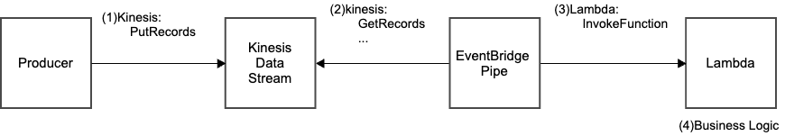
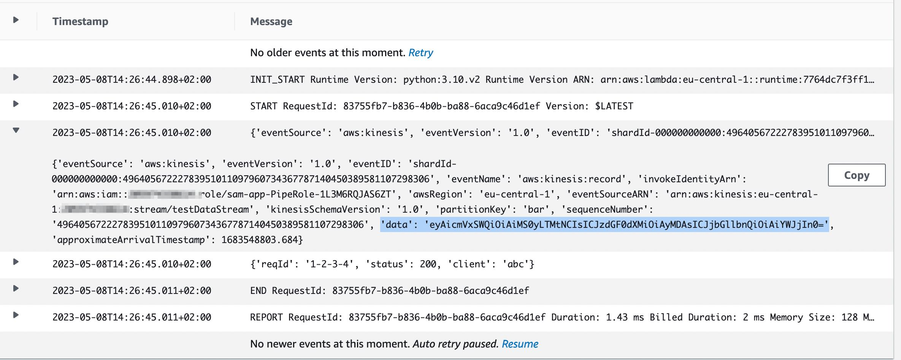

# AWS Kinesis Data Stream to AWS Lambda using EventBridge Pipes



This pattern will connect Kinesis Data Streams to AWS Lambda consumer with EventBridge Pipes.

Learn more about this pattern at the following blog: [How to Connect Kinesis to Lambda using EventBridge Pipes](https://dev.classmethod.jp/articles/eventbridge-pipes-kinesis-to-lambda-consumer)

## Requirements

* [Create an AWS account](https://portal.aws.amazon.com/gp/aws/developer/registration/index.html) if you do not already have one and log in. The IAM user that you use must have sufficient permissions to make necessary AWS service calls and manage AWS resources.
* [AWS CLI](https://docs.aws.amazon.com/cli/latest/userguide/install-cliv2.html) installed and configured
* [Git Installed](https://git-scm.com/book/en/v2/Getting-Started-Installing-Git)
* [AWS Serverless Application Model](https://docs.aws.amazon.com/serverless-application-model/latest/developerguide/serverless-sam-cli-install.html) (AWS SAM) installed

## Deployment Instructions

1. Create a new directory, navigate to that directory in a terminal and clone the GitHub repository:
    ``` 
    git clone https://github.com/quiver/blog-sam-eventbridge-pipes-kinesis-lambda
    ```
1. Change directory to the pattern directory:
    ```
    cd blog-sam-eventbridge-pipes-kinesis-lambda
    ```
1. From the command line, use AWS SAM to deploy the AWS resources for the pattern as specified in the template.yml file:
    ```
    sam deploy --guided
    ```
1. During the prompts:
    * Enter a stack name
    * Enter the desired AWS Region
    * Allow SAM CLI to create IAM roles with the required permissions.
    
    Once you have run `sam deploy -guided` mode once and saved arguments to a configuration file (samconfig.toml), you can use `sam deploy` in future to use these defaults.
1. Note the outputs from the SAM deployment process. These contain the resource names and/or ARNs which are used for testing.

## Testing

1. Use the following dummy JSON payload to trigger your producer Lambda function:
    ```
    $ aws kinesis put-record \
      --stream-name YOUR-STREAM-NAME \
      --cli-binary-format raw-in-base64-out \
      --partition-key bar \
      --data '{ "reqId": "1-2-3-4", "status": 200, "client": "abc"}'

    {
        "ShardId": "shardId-000000000000",
        "SequenceNumber": "49640567222783951011097960734367787140450389581107298306"
    }
    ```

2. Observe the logs of the consumer Lambda function to verify if the data pushed by the producer is received or not.

    


## Cleanup

 1. For deleting the stack you can use sam delete from SAM CLI -
    ```
    sam delete
    ```

---


This template is heavily inspired by  [GitHub : aws-samples/serverless-patterns](https://github.com/aws-samples/serverless-patterns).
